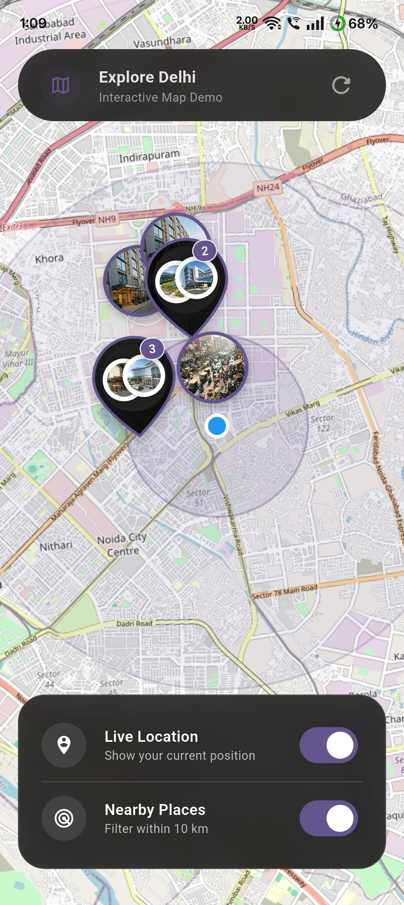
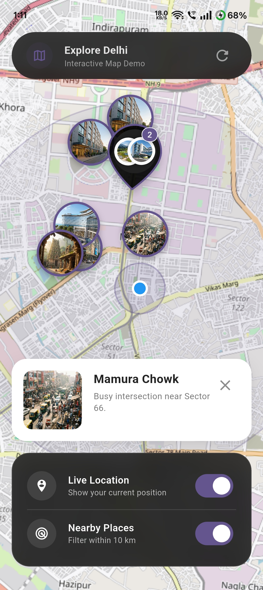

# Smart OSM Map

[](https://pub.dev/packages/smart_osm_map)
[](https://pub.dev/packages/smart_osm_map/score)
[](https://pub.dev/packages/smart_osm_map/score)
[](https://opensource.org/licenses/MIT)
[](https://flutter.dev)

A production-ready Flutter package for OpenStreetMap integration. It provides clustered markers, image support, user location display, and nearby filtering with animated radius effects.

Built on top of `flutter_map`, this package offers a "plug-and-play" experience with strong UX defaults, privacy-safe location handling, and a clean API.

## Showcase

<p align="center">
  <table border="0">
    <tr>
      <td align="center"><b>Premium Teardrop Clusters</b><br/></td>
      <td align="center"><b>Animated Nearby Radiations</b><br/></td>
    </tr>
    <tr>
      <td align="center"><b>Glassmorphic UI</b><br/></td>
      <td align="center"><b>Smooth Map Interaction</b><br/></td>
    </tr>
  </table>
</p>

## Features

- **Clustered Markers**: Automatically clusters markers to reduce clutter and improve performance.
- **Image Markers**: Supports both network images and local asset images for markers.
- **User Location**: Optional support to show the user's current location with safe permission handling.
- **Nearby Filtering**: Filter markers within a configurable radius from the user, complete with an animated ripple effect.
- **Privacy First**: Does not track, store, or transmit user location data. Location is only accessed when explicitly enabled by you.
- **Customizable**: Control marker size, border colors, cluster colors, and more.
- **No API Keys**: Uses OpenStreetMap tiles, requiring no API keys for standard usage.

## Installation

Add `smart_osm_map` to your `pubspec.yaml`:

```yaml
dependencies:
  smart_osm_map: ^0.1.0
```

## Usage

### 1. Define Your Data Model

First, define the data you want to display on the map. This can be any Dart class.

```dart
class Place {
  final String name;
  final double lat;
  final double lng;
  final String image; // Asset path or network URL

  const Place({
    required this.name,
    required this.lat,
    required this.lng,
    required this.image,
  });
}
```

### 2. Basic Implementation

Use the `.simple` constructor to map your data list to the map.

```dart
import 'package:smart_osm_map/smart_osm_map.dart';

class MyMapScreen extends StatelessWidget {
  @override
  Widget build(BuildContext context) {
    // Your list of places
    final List<Place> places = [ /* ... */ ];

    return Scaffold(
      body: SmartOsmMap.simple(
        items: places,
        // Extract location data
        latitude: (place) => place.lat,
        longitude: (place) => place.lng,
        // Extract marker image (optional)
        markerImage: (place) => place.image, 
        // Handle taps
        onTap: (place) {
          print('Tapped on ${place.name}');
        },
      ),
    );
  }
}
```

### 3. Advanced Features & Customization

The following example demonstrates how to enable user location, toggle "Nearby" filtering, and customize the map style within a `StatefulWidget`.

```dart
class SmartMapPlayground extends StatefulWidget {
  @override
  State<SmartMapPlayground> createState() => _SmartMapPlaygroundState();
}

class _SmartMapPlaygroundState extends State<SmartMapPlayground> {
  bool showUserLocation = false;
  bool enableNearby = false;

  @override
  Widget build(BuildContext context) {
    return SmartOsmMap.simple(
      items: places,
      latitude: (p) => p.lat,
      longitude: (p) => p.lng,
      markerImage: (p) => p.image,

      // --- Feature 1: User Location ---
      // Toggle this boolean to show/hide the user's location.
      // The package handles permission requests automatically.
      showUserLocation: showUserLocation,

      // --- Feature 2: Nearby Filtering ---
      // When enabled, only shows items within `nearbyRadiusKm` of the user.
      enableNearby: enableNearby,
      nearbyRadiusKm: 10, 

      // --- Feature 3: Styling ---
      markerSize: 64,
      markerBorderColor: Colors.deepPurple,
      clusterColor: Colors.black87,
      radiusColor: Colors.deepPurple.withOpacity(0.3),
      
      // --- Feature 4: Interaction ---
      onTap: (place) {
        // Handle marker tap (e.g., show a modal or navigate)
        showModalBottomSheet(
          context: context, 
          builder: (_) => Text(place.name),
        );
      },
      
      // --- Feature 5: Permission Handling ---
      // Optional callbacks to handle permission states in your UI
      onLocationPermissionDenied: () {
        ScaffoldMessenger.of(context).showSnackBar(
          SnackBar(content: Text('Location permission is required.')),
        );
      },
    );
  }
}
```

## Configuration

| Parameter | Type | Default | Description |
|---|---|---|---|
| `items` | `List<T>` | Required | The list of data objects to display on the map. |
| `latitude` | `double Function(T)` | Required | Function to extract latitude from your data object. |
| `longitude` | `double Function(T)` | Required | Function to extract longitude from your data object. |
| `markerImage` | `String? Function(T)?` | `null` | Function to extract image URL (http/asset) for the marker. |
| `onTap` | `void Function(T)?` | `null` | Callback when a marker is tapped. |
| `showUserLocation` | `bool` | `false` | Whether to show the user's location on the map. |
| `enableNearby` | `bool` | `false` | Whether to filter items based on distance from user. |
| `nearbyRadiusKm` | `double` | `10` | The radius in kilometers for nearby filtering. |
| `markerSize` | `double` | `56` | Size of the marker icons. |
| `minZoom` | `double` | `2.0` | Minimum zoom level (how far you can zoom out). |

## OS Permissions

This package uses `geolocator` to handle location. You must configure your app for location access.

### Android

Add the following to your `<project>/android/app/src/main/AndroidManifest.xml`:

```xml
<uses-permission android:name="android.permission.ACCESS_FINE_LOCATION" />
<uses-permission android:name="android.permission.ACCESS_COARSE_LOCATION" />
```

### iOS

Add the following to your `<project>/ios/Runner/Info.plist`:

```xml
<key>NSLocationWhenInUseUsageDescription</key>
<string>This app needs access to location when open to show nearby places.</string>
```

## Privacy & Safety

- **No Tracking**: `smart_osm_map` does not track user location in the background.
- **No Data Collection**: Location data is processed locally on the device to render the user layer and calculate distances. It is never sent to any external server by this package.
- **Store Friendly**: Designed to comply with Apple App Store and Google Play Store privacy guidelines regarding location usage.

## Best Practices

- **Large Datasets**: While clustering helps with performance, extremely large datasets (thousands of items) may still impact performance depending on the device.
- **Tile Servers**: By default, this uses standard OpenStreetMap tiles. Ensure you comply with their [Tile Usage Policy](https://operations.osmfoundation.org/policies/tiles/) for heavy usage, or swap with your own tile provider if needed.
